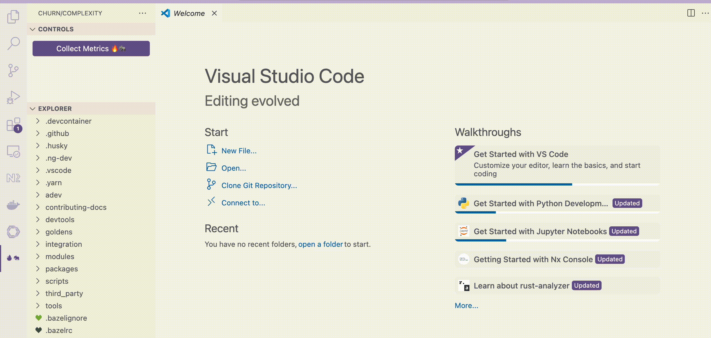

# Churn/Complexity Explorer

A file explorer plugin that visualizes which parts of the codebase have the highest churn and complexity.

This is probably not too interesting for codebases you already know well, but could be of use if you
want to see where the action is going on in an unknown codebase.

## Features

* Open a workspace and activate the extension
* Press the "Collect Metrics" Button

=> When the collection is done, the file explorer will visualize churn and complexity hotspots
by adding

* zero to four flames 🔥🔥🔥🔥 as churn indicator
* zero to four elephants 🐘🐘🐘🐘 as complexity indicator

Here is a demo that shows the extension in action on the repository of the Angular project:

Note:

#### 🔥/🐘-Metrics are relative

Many flames or elephants are not automatically bad, they only display which files are the 
"hottest" and most complex relative to the others. So, for example, even if all files are very small in a codebase, there will still be files with higher LOC count *relative to the others*.

#### Scale is logarithmic

Churn count and LOC are scaled logarithmically, so that in order to increase the flame/elephant count by one, the file needs to rank twice as high in the respective metric.

#### Directories get the max-value of their children

The churn/complexity of a directory is the maximum of the churn/complexity of its children.

## Known Issues

This project is still in a very early stage.

